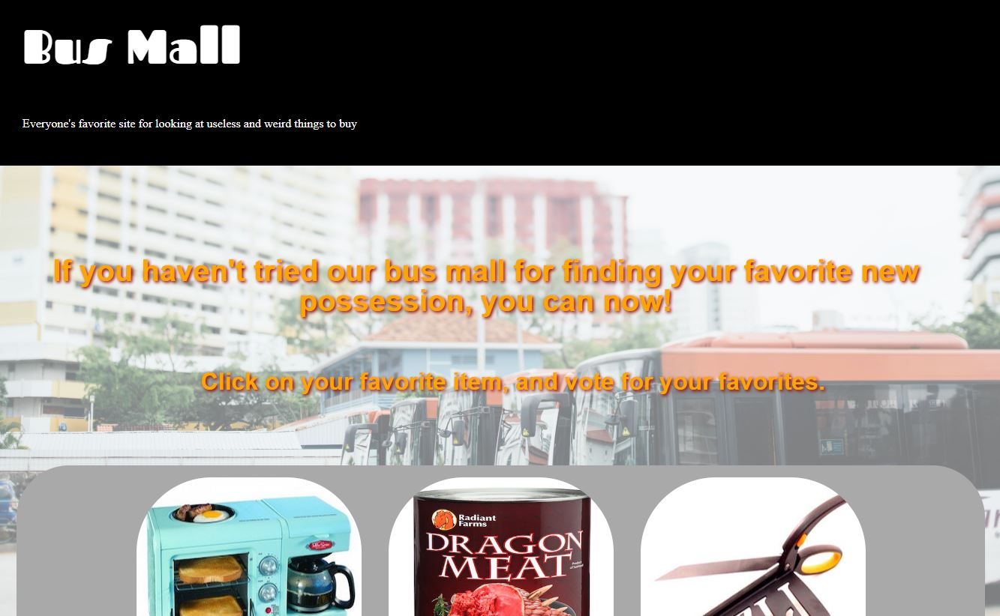

# Bus Mall
A web application built with JavaScript, HTML and CSS, that makes use of a JavaScript library called chart.js. An event listener and an event handler is also used within the code. The page shows three pictures that a user can click on. Each time a user clicks on an image,the selection of pictures randomly changes, with the stipulation that no picture is duplicated during a viewing, and that every picture that is shown, cannot have been one that just appeared. With every click, the number of clicks are tallied up, along with the number of times that a image is viewed. Each user adds to the overall collection of data, using local storage. The local storage is only refreshed when the developer chooses. At the end of each user's voting session, 25 clicks, the data is used to populate graphs and charts from the collection of data in the local storage for easier analysis at the bottom of the page. 

# Project Status
Project currently is able to do all the above. Future goals include adding in buttons below the images (above where the charts are rendered), which (1) allow the user to refresh the page, (2) clear the localStorage. Other interactive controls for future renditions of this project may include ways to allow the user to view one graph at a time, or at least to be taken to the graph of choice with a click. I would also like to build out an order form page that allows a user to add the item of choice and amount into their cart, for that to be saved into localStorage, and then accessed again when the person is ready to checkout. All items are of course fictional, so this would be a practice in adding in the e-commerce section of a website, not making it truly function with transactions. 

# Getting Started
Clone GitHub repo by copying link on GitHub repo page. Return to to your terminal, where you should create a folder where you would like the cloned project to live. Type into your terminal: 'git clone ' + [paste the copied web url for the repo].

# Prerequisites
A working internet connection to clone the project, afterwards, either use of live-server or an internet connection to view and/or work on the page. 

# Author
Sharina Stubbs

# License
This project is licensed under the MIT License - see the license.md file for more details.

# Acknowledgements
Big thanks to the creators of the Code Fellows curriculum for outlining the guidelines for this project. Even greater thanks to Lena Eivy, the instructor for Code 201 at Code Fellows, for teaching the concepts required for this project. A shout out of thanks to Ron Dunphey, a fellow developer and class TA, for the insights, guidance and suggestions during the development of the project. 
